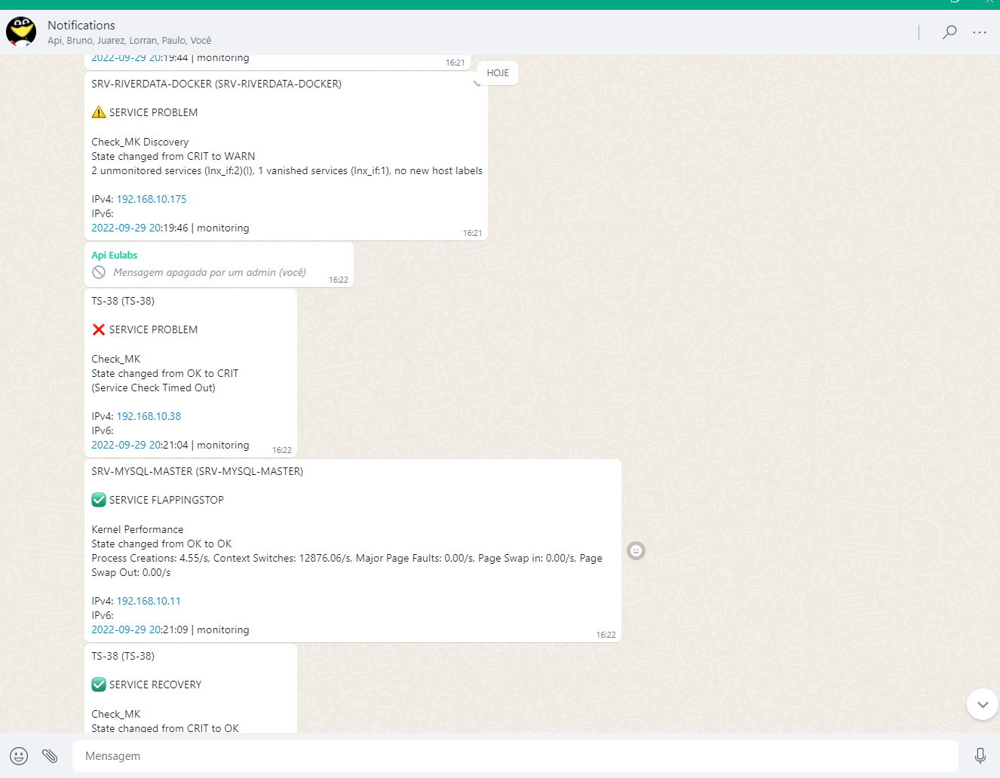
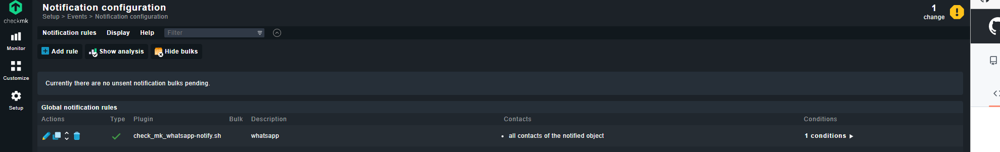
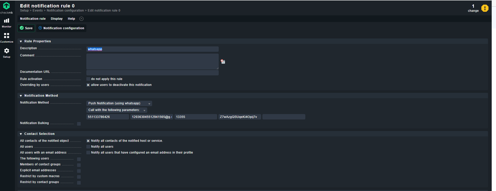

# Check_MK WhatsApp notification
<br>

<div align="center">
 
</div>

<br>
<div align="center">
 -  


</div>
<br>

## COMPATIBILITY
- Check_MK RAW version 1.6.0
- Check_MK RAW version 2.1.0p4
- Should also work with other versions of Check_MK


## EXAMPLE
Notifications are usually sent via a WhatsApp group. Here is an example of how a WhatsApp notification is structured.



## REQUIREMENTS
In order for Check_MK to send alerts (notifications) to the WhatsApp Messenger, we need

* WhatsApp line
* url api whatsapp and port
* WhatsApp API token
* a WhatsApp Chat- or Group-ID

## Creating WhatsApp API Key:

To use this shipment, it is necessary to contract the service.

To hire, visit https://www.netizap.app/

## INSTALLATION
Change to your Check_MK site user
```
su - mysite
```

Change to the notification directory
```
cd ~/local/share/check_mk/notifications/
```

Download the WhatsApp notify script from Git repository
```
git clone https://github.com/welligtonalves/check_mk-whatsapp-notify .
```

Give the script execution permissions
```
chmod +x check_mk_whatsapp-notify.sh
```

## CHECK_MK CONFIGURATION
### CHECK_MK VERSION 2.0.0 AND ABOVE
Now you can create your own alarm rules in Check_MK.

```Setup → Events → Notifications```

First create a clone of your existing mail notification rule



* Change the description (e.g. Notify all contacts of a host/service via WhatsApp)
* The notification method is "Push Notification (by WhatsApp)"
* Select option "Call with the following parameters:"
* As the first parameter we set the WhatsApp line (API number provided)
* The second parameter is the WhatsApp destiny WhatsApp line / Group-ID
* The third parameter is the api port WhatsApp
* The fourth parameter is the api key WhatsApp



<br>

## INSPIRATION
* Thanks for the excellent script for telegram with some adjustments we managed to make it functional for use with whatsapp. https://github.com/filipnet/checkmk-telegram-notify

## LICENSE
checkmk-whatsapp-notify and all individual scripts are under the BSD 3-Clause license unless explicitly noted otherwise. Please refer to the LICENSE